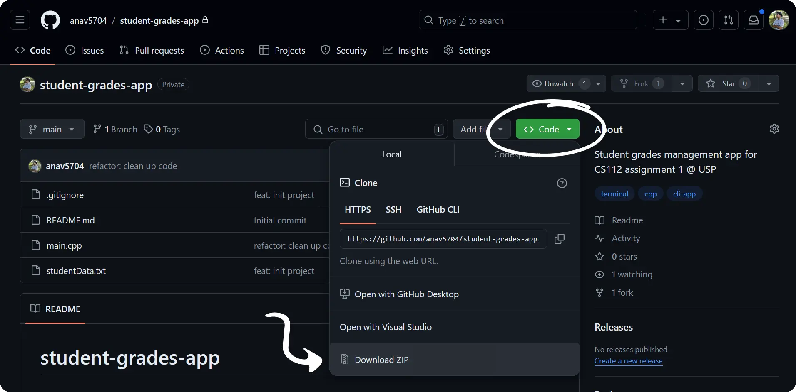

# Student Grades App

This CLI app was made as a part of assignment 1 for CS1112 (Introduction to Data Structures and Algorithms) at the [University of the South Pacific](https://usp.ac.fj). The program is built using C++ and shows the advantages of using structs over parallel arrays.

## Features

- View all students' details - as a user, you can view all students' details in a table format
- View top student's details - as a user, you can view the top students' details in a table format
- View grade statistics - as a user, you can view the average mark and pass rate of all students
- Update student's marks - as a user, you can update the coursework and final exam marks of a student

## Getting Started

### General

Download the .zip folder by clicking on the green `Code` button and selecting `Download ZIP`. Extract the contents to your local machine and open it using and IDE of your choice. Click on `compile and run` to use the app.



### Technical

First fork and clone the repo. Make sure you have the G++ compiler installed. Then, run and compile the program:

```bash
g++ -o app.cpp A1_S11221203_S11180069.cpp
```

Once successfully compiled, you can execute the output file using:

```bash
./app.cpp
```

## User Manual

After running the program, you will be prompted to enter a choice that corresponds to a feature.

- Press `1` to view all students' details
- Press `2` to view top students' details
- Press `3` to view grade statistics
- Press `4` to update student's marks. You will be prompted to enter the student ID, new coursework, and new final exam marks
- Press `5` to exit the program

## Authors

- [Anav Chand](https://github.com/anav5704/)
- [Seiloni Tuungahala](https://github.com/seiutuone)
